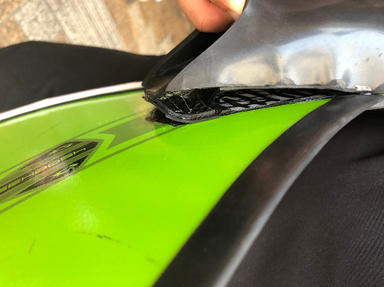
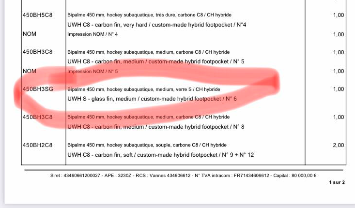
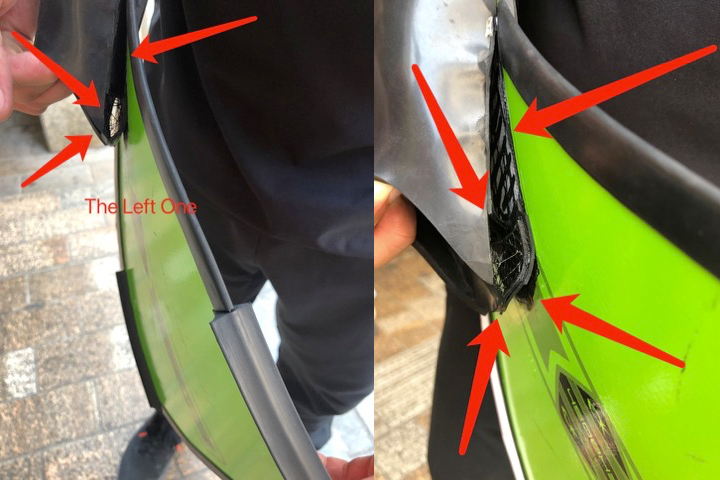
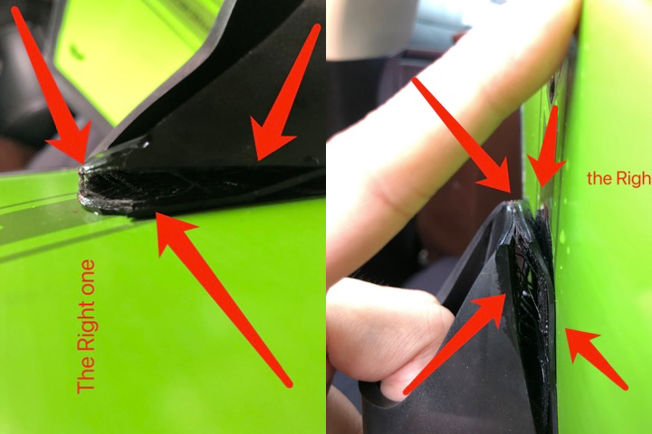
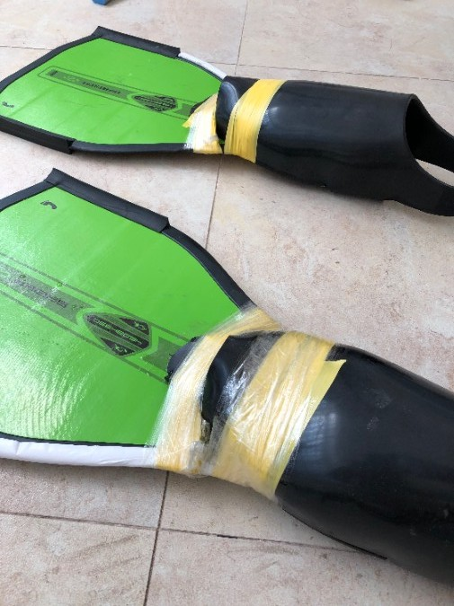
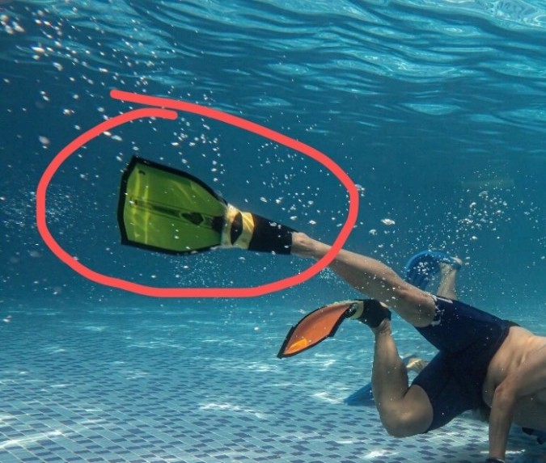

# BreierFins 
------
It’s a sad story

# What would happen if you used **Breier** fins to enter the UWH race

## Here’s the thing

### Buy

I’m a beginner and bought the latest Breier 450BH3SG through Mr.YANG Wenjie, the Chinese brand agent
here is the bill.

### After 5 uses only!!!!!

It’s just normal use. Both fins are broken. I’m not the only one in this situation. To understand that other people are also damaged in varying degrees.

about detail
[left1](img/l1.jpg)
[left2](img/l2.jpg)
[right](img/r1.jpg)
[right](img/r2.jpg)

### UWH race

Before the race, I was told to use shoe glue to try and fix it

Of course, We lost the game

## After sale claim

### Can’t return it,  Just to fix it

Breier fins used to be one of the best fins in underwater hockey. The older models are favored by many athletes and fans.

Unfortunately, the new fins are a real disappointment. Because you’d never guess that the fins only last five tries and then die.

I believe that this is a very obvious product quality problem, as consumers should be given the right to protect.

### Repair Not Rebuilt

Mr. Yang, the China agent, told me that Breier was impossible to return and had never done so. Only glue can be used for repair treatment (the time required for repair is uncertain) . Or send that fins back to the French factory headquarters, have the factory repair me, and pay the high cost of international express delivery (China to France, France to China)

Personally, I think this is obviously a matter of product design and quality. You Can’t fix it by fixing it. It should be disassembled and rebuilt by the manufacturer to solve the problem.

Otherwise, soon after the repair will also appear in the case of damage, not guaranteed.

### This time the Breier flippers really broke my heart.

------
# Langue française.
------
C’est une triste histoire
# que se passerait-il si vous avez utilisé **breier** fins pour entrer dans la course uwh

## voici la chose

### acheter

Je suis un débutant et j’ai acheté le plus récent breier 450bh3sg par l’intermédiaire de m. yang wenjie, l’agent de marque chinois.
Voici le projet de loi.

### après 5 utilise seulement!!!!!

C’est juste une utilisation normale. Les deux nageoires sont brisées. Je ne suis pas la seule dans cette situation. Comprendre que d’autres personnes sont également endommagées à des degrés variables.

about detail
[left1](img/l1.jpg)
[left2](img/l2.jpg)
[right](img/r1.jpg)
[right](img/r2.jpg)

### UWH race

Avant la course, on m’a demandé d’utiliser la colle de chaussures pour essayer et la corriger.

Bien sûr, nous avons perdu le jeu.

## après la demande de vente.

### ne peut pas le retourner, juste pour le corriger

Les nageoires de breier étaient l’une des meilleures nageoires du hockey sous-marin. Les modèles plus anciens sont favorisés par de nombreux athlètes et fans.
Malheureusement, les nouvelles nageoires sont une véritable déception. Parce que vous ne devriez jamais que les nageoires ne durent que cinq fois, puis meurent.
Je crois qu’il s’agit là d’un problème très évident de qualité du produit, car les consommateurs devraient être habilités à protéger.

### réparation non reconstruite

M. yang, l’agent chinois, m’a dit que le brebis était impossible à retourner et n’avait jamais fait cela. Seul le glue peut être utilisé pour le traitement de réparation (le temps nécessaire pour la réparation est incertain) . Ou envoyez ces fins au siège de l’usine française, faites la réparation de l’usine, et payez le coût élevé de la livraison express internationale (chine vers la france, france vers la chine) .
Personnellement, je pense que c’est évidemment une question de conception et de qualité du produit. Vous ne pouvez pas la corriger en la fixant. Il doit être démonté et reconstruit par le fabricant pour résoudre le problème.
Sinon, peu de temps après la réparation apparaîtra également dans le cas des dommages, pas garanti.

### cette fois que les flippers de breier ont vraiment brisé mon cœur.

